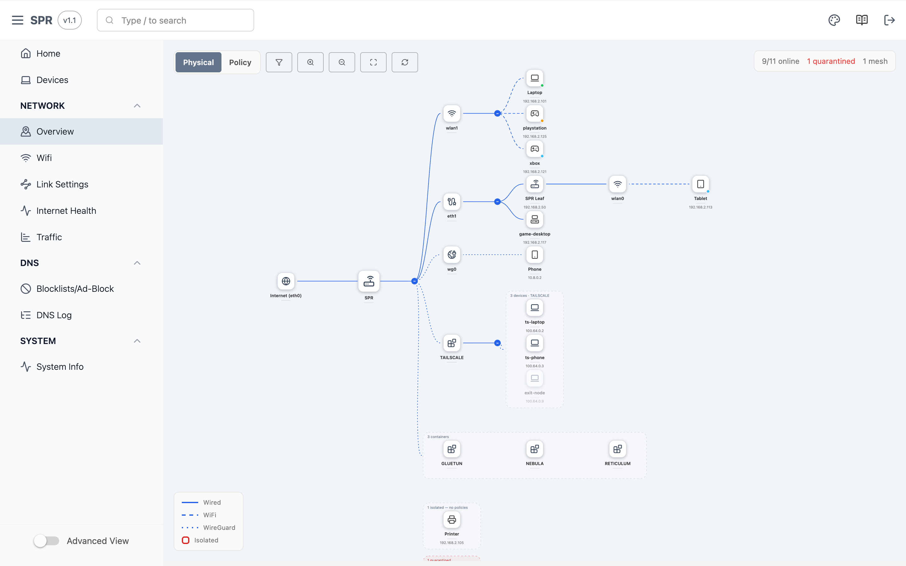
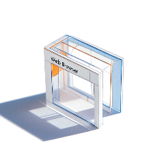
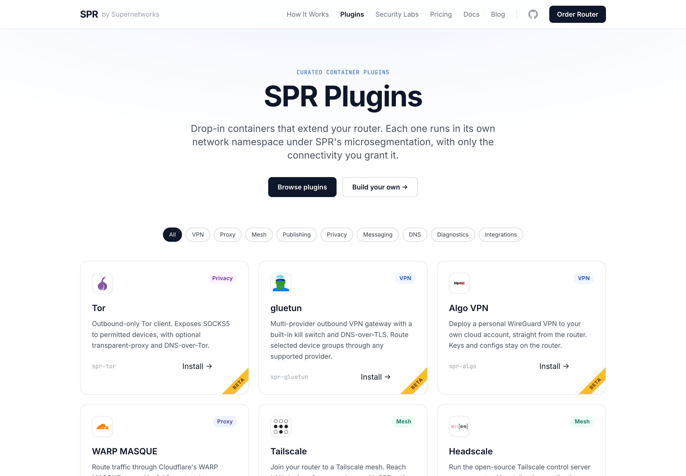

# SPR: Secure Programmable Router

[](https://github.com/spr-networks/super/releases/latest)


[](https://github.com/spr-networks/super/blob/main/LICENSE)

## Overview

Create an adaptive, micro-segmented network for managing WiFi devices, remote VPN access, and wired systems.

* One Password Per WiFi Device
* Policy Based / Zero Trust Network Access
* Per-Device DNS Rules & Ad Block Lists

<a href="https://demo.supernetworks.org/"></a>

<a href="https://demo.supernetworks.org/"></a>

## Features

<table>
  <tr>
    <td valign="top" width="33%">
      <p align="center"><br><b>Security</b></p>
      <ul>
        <li>Multi-PSK including with WPA3, a SPR first</li>
        <li>Secure Router Chaining</li>
        <li>Almost no unmanaged code, minimized attack surfaces</li>
      </ul>
    </td>
    <td valign="top" width="33%">
      <p align="center"><br><b>Firewall</b></p>
      <ul>
        <li>Policy based routing</li>
        <li>Isolation by default</li>
        <li>Bidirectional groups and unidirectional service rules</li>
        <li>Secure container networking</li>
      </ul>
    </td>
    <td valign="top" width="33%">
      <p align="center"><br><b>WiFi</b></p>
      <ul>
        <li>WPA3/2</li>
        <li>WPA1 backwards compatibility</li>
        <li>WiFi 6, 7 Support including MLO and 320mhz channels on supported hardware</li>
      </ul>
    </td>
  </tr>
  <tr>
    <td valign="top" width="33%">
      <p align="center"><br><b>Advanced Networking</b></p>
      <ul>
        <li>Wireguard™ VPN</li>
        <li>Multi WAN with Load Balancing</li>
        <li>Wireless Uplink</li>
        <li>Multicast Traffic Support</li>
        <li>Mesh with Wired Backhaul *</li>
        <li>Policy Based Site Forwarding *</li>
      </ul>
    </td>
    <td valign="top" width="33%">
      <p align="center"><br><b>Advanced DNS Capabilities</b></p>
      <ul>
        <li>Remote DNS Queries with DNS over HTTPs</li>
        <li>DNS Ad Block lists</li>
        <li>Per-Device DNS Rules and Overrides</li>
        <li>DNS Rebinding Protection</li>
      </ul>
    </td>
    <td valign="top" width="33%">
      <p align="center"><br><b>User Friendly</b></p>
      <ul>
        <li>React UX</li>
        <li>iOS App Available</li>
      </ul>
    </td>
  </tr>
  <tr>
    <td valign="top" width="33%">
      <p align="center"><b>Observability</b></p>
      <ul>
        <li>Traffic Insights by Country & ASN</li>
        <li>Internet & Uplink Health Monitoring</li>
        <li>Alerts</li>
        <li>DNS Logs</li>
        <li>Event System & DB</li>
      </ul>
    </td>
    <td valign="top" width="33%">
      <p align="center"><b>Interoperability</b></p>
      <ul>
        <li>Runs on a wide variety of Linux systems with Docker</li>
        <li>API Plugin System</li>
      </ul>
    </td>
    <td valign="top" width="33%">
      <p align="center"><b>Parental Controls</b></p>
      <ul>
        <li>Family DNS Rules</li>
        <li>Device Time Limits</li>
      </ul>
    </td>
  </tr>
</table>

&ast; Some features are part of SPR PLUS, a paid subscription to support the project

## Plugins

Extend SPR with Docker based plugins. Use community supported plugins or write your own. Browse the catalog at https://www.supernetworks.org/plugins.html

<a href="https://www.supernetworks.org/plugins.html"></a>

## How it Works

An unspoofable device identity is established with a MAC address and Per-Device Passphrase for WiFi (or a VPN Public Key for Remote Devices). From there, each device gets its own /30 subnet to exist on. Hardening and strict firewall rules block network spoofing and impersonation, and routing rules redefine connectivity between devices and to the internet.

## Our Goals
1. Be the best Security & Privacy choice
2. Programmable with an API 
3. Easy to use 

## Frequently Asked Questions
Check out our [FAQ](https://www.supernetworks.org/pages/docs/faq) on our website

## UI Demo Page

https://demo.supernetworks.org/

## SPR Bus Events

https://github.com/spr-networks/sprbus-json


## Updating
#### Building from scratch
```bash
./build_docker_compose.sh --load
docker-compose up -d
```

For performance and to minimize wear on SD cards, the build uses a memory-backed filesystem. On memory-limited devices, this can cause build failures if memory is exhausted. In this case, you can provide the build argument `--set "*.args.USE_TMPFS=false"`.


#### Using prebuilt containers
```bash
docker-compose pull
./setup.sh # (optional)
docker-compose up -d
```

## Get Involved

💬 Have questions? Join the conversation in our [Discussions](https://github.com/spr-networks/super/discussions) page.
* [Join the Discord chat](https://discord.gg/EUjTKJPPAX)
* [Stay in the loop](https://sendfox.com/supernetworks) with our newsletter

## Useful Links

* [supernetworks.org](https://www.supernetworks.org/)
* [API Docs](https://www.supernetworks.org/pages/api/0)
* [Documentation Home](https://www.supernetworks.org/pages/docs/intro)
* [Raspberry Pi 4/5 Setup Guide](https://www.supernetworks.org/pages/docs/setup_guides/pi4b)
* [General Setup Guide](https://www.supernetworks.org/pages/docs/setup_guides/setup_run_spr)
* [Virtual Setup Guide (Personal VPN)](https://www.supernetworks.org/pages/docs/setup_guides/virtual_spr)

* [FAQ](https://www.supernetworks.org/pages/docs/faq)
* [Get the iOS App](https://apps.apple.com/us/app/secure-programmable-router/id6443709201)


